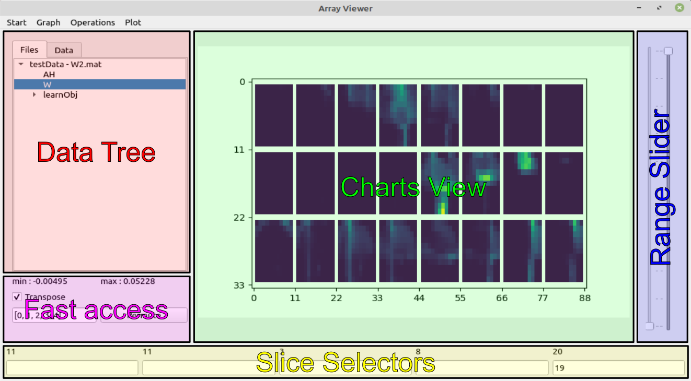

Basics
######

.. _load_data:

Load Data
*********
To load a dataset click ``Start > Load data``. You can select a file of the types *.data, .hdf5, .mat, .npy, .txt* or any image file. If your data is structured such that the first dimension should be put to the end of the dataset, you can check the corresponding checkbox at the bottom of the load dialog. The selected option is saved for consecutive loadings, even after closing the program. If you are loading a dataset with the same name as an existing file you will be asked if the file should be replaced or if the dataset should be added with a different name instead. Another way to open any file is by appending its name to the function call when opening the ArrayViewer, i.e. ``aview file.npy``. Finally you can also drag and drop a file inside the window to load it.

Window Structure
****************

The main ArrayViewer window consists of five separate sections as shown above and explained hereafter.

Data Tree
=========
The Data Tree contains the loaded data. The structure of the tree represents the structure of the loaded data. Right-click on any key to rename, reshape or delete it in the tree. When right-clicking a key with children, you can also combine its children. These operations will not change the original file! If you select any key without a child key its representation will appear in the Charts View. The second tab, called ``Data``, contains the same data as the ``Files`` tab. It is not structured file-by-file, but the file (selected when switching tabs) is grouped with similar files. This is especialy useful, if you want to look at multiple files of the same structure. Currently the reshaping and difference options of the start menu are disabled when in this view.

Charts View
===========
Contains a plot of the last selected data. Depending on the datatype of the values this might be just text (for single values, strings and list of strings), a plot (for 1D or 2D data) or an image (for multidimensional data).

Slice Selectors
===============
The slice selectors enable the slicing of the selected dataset. The amount of fields next to each other is equal to the number of dimensions of the current datum. You can enter any number within the range given in the label of the text field. Slicing with colons is also supported. Lists of single values are currently not supported. When the mouse is over one of the text fields, use the scrollwheel to increment (or decrement) the values within the field by 1 (10 with [Ctrl] and 100 with the [Shift] modifier). This also works for colon-slicing, where the [Ctrl] modifier increments (or decrements) by the given stepsize. The [Shift] modifier is changing by 100, similar to the non-colon case.

Fast Access
===========
The two values (min/max) give the extrema of the currently selected and sliced dataset.
With the transpose checkbox the first two dimensions of the data can be flipped in the plots.
Finally the Permute field and its adjacent button can be used to permute the Dimensions of the current dataset. For that you have to enter the order of dimensions seperated by commas into the text field and push the button. Any brackets and braces will be striped. The input must include all dimension indices of the data.

Range Slider
============
The range slider is inactive by default. When a colorbar is added to the plot, one can change the color limits of the shown plot.

