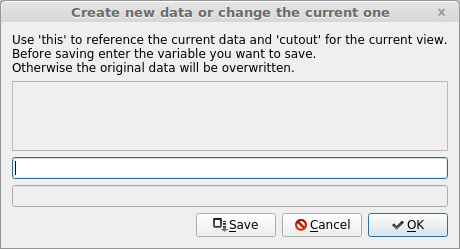

Menu Stucture
#############
Start menu
**********
Contains:

* :ref:`load_data` (Ctrl+O) - loading a dataset into the data tree
* Save (Ctrl+S) - saving the chart view to an image or pdf
* `New Data`_ (Ctrl+N) - creating a new dataset (maybe using the currently selected)
* Reshape (Ctrl+R) - reshape the current dataset.
  Enter the comma separated new shape into the ``new shape`` text box. Suggestions will be made whenever you type a comma.
* Difference (Ctrl+D) - calculate the difference of two values in the tree view.
  Select two values with equal shapes from the tree view and press the ``Calculate the Difference`` button. A new dataset will be created containing both values and the difference of the two
* Delete All Data (Ctrl+X) - clear the complete data tree

New Data
========
Opens a new window to generate a new dataset. 

Enter any python expression into the text field and press ``OK``. If it is a legitimate assignment it will be run and added to the history above. Otherwise an error will be shown below. You can use the keyword ``this`` for operations on the current dataset. Furthermore the keyword ``cutout`` refers to the currently cut-out part of the current dataset (= what you see in the charts view). After running your calculations the value can be stored using the ``Save`` button. If you leave the text field empty, the currently selected data will be overwritten. When adding any of the formerly created variable names to the text field a new dataset will be created with that name and the respective value.

Graph menu
**********
The ``Colorbar`` option enables or disables the colorbar for image plots.
The different ``Colormap`` options select the corresponding colormap for all subsequent image plots. There are five options to choose from: *jet, grey, hot, bws* and *viridis*

Operations menu
***************
The operations menu is a shortcut for performing one-dimensional operations on the datasets. Select one of the operations (``Min``, ``Mean``, ``Median``, ``Max``) and the corresponding operation will be performed on one or more selected dimensions of the dataset. To select a dimension, click on the corresponding number (above the text field) in the slice selectors. If you select ``None`` it resets this behavior.

Plot menu
*********
The plot menu offers plotting routines apart from the ones used by default. You can plot a graph of the minimum, mean and maximum value of a 2D Dataset (``min-mean-max plot``), plot all 2D datasets instead of showing an image (``2D as plot``), show a scatter 2D data for Ax2, Ax3 and Ax4 Data(``2D as Scatter``) or plot any A x B x 3 data as an RGB image (``3D as image``). If you select ``Print Values as text`` any values will be printed directly into the Charts View. The option ``Keep Slice on data change`` keeps the current slice, from the Slice Selectors, fixed when you select another Dataset. It enables faster switching between datasets of the same structure. The option for the ``Dark Window mode`` is also located there.
